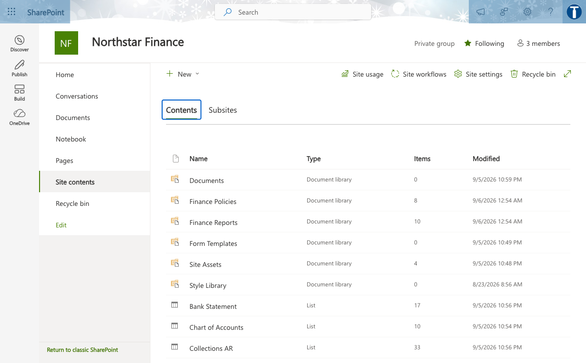

# Lab 01 — Tenant readiness to Opportunity scoring

TGS-2024044051 · v1.0 · 27 September 2026

## Scenario
Northstar Service is a synthetic service organisation. All records and metrics in this lab are fictional. Use an approved training tenant if available; otherwise complete the same evidence analysis offline.

## Materials
- `scenario.csv`: 5 synthetic case records with task volumes, timing, claims and access values.
- `roles.csv`: pilot roles, licences and approved data access.
- `pilot-metrics.csv`: synthetic active seats, wage and license assumptions, and latency timings.
- `ui-reference.png`: authentic Tertiary Infotech training-tenant UI example; your tenant may differ.
- `source-pack.md`: synthetic policy excerpts, an outdated source and an injection test.
- `evidence-template.md`: learner evidence form.
- Microsoft 365 Copilot or Copilot Studio only when your trainer has provided access.

## Procedure
1. **Tenant readiness.** Open the matching row in `scenario.csv`, then check its role against `roles.csv` and source against `source-pack.md`. Record the source version and owner. Check identities, data estate and licensed workload availability. Calculate net minutes saved as baseline minus pilot minus review, and verify supported claims do not exceed total claims. Save the output as `01-tenant-readiness.md`. Check: Admin signs off app and data prerequisites. Negative test: Licensed user lacks a supported app or data source. Measure: Eligible users divided by target users.
2. **License allocation.** Open the matching row in `scenario.csv`, then check its role against `roles.csv` and source against `source-pack.md`. Record the source version and owner. Match entitlement to high-frequency document tasks. Calculate net minutes saved as baseline minus pilot minus review, and verify supported claims do not exceed total claims. Save the output as `02-license-allocation.md`. Check: Approve seats against role and cost center. Negative test: Seat assigned but service plan disabled. Measure: Active pilot users divided by assigned seats.
3. **Graph permission scope.** Open the matching row in `scenario.csv`, then check its role against `roles.csv` and source against `source-pack.md`. Record the source version and owner. Compare search results under user A and user B. Calculate net minutes saved as baseline minus pilot minus review, and verify supported claims do not exceed total claims. Save the output as `03-graph-permission-scope.md`. Check: Least privilege and owner review. Negative test: Overshared file appears in both result sets. Measure: Unexpected accessible files count.
4. **Business-process mapping.** Open the matching row in `scenario.csv`, then check its role against `roles.csv` and source against `source-pack.md`. Record the source version and owner. Mark drafting, lookup and approval steps. Calculate net minutes saved as baseline minus pilot minus review, and verify supported claims do not exceed total claims. Save the output as `04-business-process-mapping.md`. Check: Keep human approval on customer-facing send. Negative test: Automation bypasses approval. Measure: Median handoff time in minutes.
5. **Opportunity scoring.** Open the matching row in `scenario.csv`, then check its role against `roles.csv` and source against `source-pack.md`. Record the source version and owner. Score volume, time, data quality and risk. Calculate net minutes saved as baseline minus pilot minus review, and verify supported claims do not exceed total claims. Save the output as `05-opportunity-scoring.md`. Check: Reject use case with ungoverned sensitive data. Negative test: High score hides missing data owner. Measure: Weighted score per use case.

## Copy-ready Copilot prompt
```text
You are supporting a synthetic Northstar Service training case. Use only the provided scenario row. Identify your sources and assumptions. Complete the requested transformation, then list every claim that requires human verification. Never send, publish, grant access, or change production data.
```

## Acceptance
- Five output artifacts correspond to the five rows in `scenario.csv`.
- Recompute `net_minutes_saved` independently from the three timing columns; record the source version used.
- For ROI use the role’s hourly value and license cost from `pilot-metrics.csv` as labelled synthetic assumptions.
- For latency, add retrieval, model and tool component times for the same percentile; do not mix p50 with p95.
- Record whether the role may open the source; do not use the injected or retired source as an instruction.
- Every artifact records source, method, reviewer, date and a pass/fail decision.
- At least one failed or uncertain test is recorded with a correction.
- No real customer or tenant data appears in submitted evidence.

## Troubleshooting
If the Microsoft feature is unavailable, state the licence/policy limitation and use the synthetic row to complete the same decision and validation evidence. Do not fabricate a live configuration.

## UI reference

This screenshot orients you to a Microsoft workspace. It is not evidence of your own configuration; submit your own screenshot or clearly labelled offline artifact.
