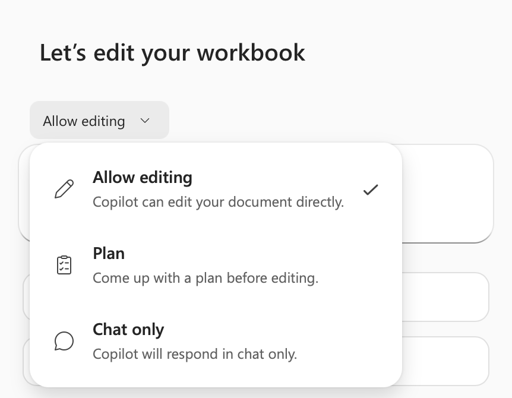

# Lab 03 — Outlook response workflow to Sensitivity labels

TGS-2024044051 · v1.0 · 27 September 2026

## Scenario
Northstar Service is a synthetic service organisation. All records and metrics in this lab are fictional. Use an approved training tenant if available; otherwise complete the same evidence analysis offline.

## Materials
- `scenario.csv`: 5 synthetic case records with task volumes, timing, claims and access values.
- `roles.csv`: pilot roles, licences and approved data access.
- `pilot-metrics.csv`: synthetic active seats, wage and license assumptions, and latency timings.
- `ui-reference.png`: authentic Tertiary Infotech training-tenant UI example; your tenant may differ.
- `source-pack.md`: synthetic policy excerpts, an outdated source and an injection test.
- `evidence-template.md`: learner evidence form.
- Microsoft 365 Copilot or Copilot Studio only when your trainer has provided access.

## Procedure
1. **Outlook response workflow.** Open the matching row in `scenario.csv`, then check its role against `roles.csv` and source against `source-pack.md`. Record the source version and owner. Draft acknowledgement and response options. Calculate net minutes saved as baseline minus pilot minus review, and verify supported claims do not exceed total claims. Save the output as `01-outlook-response-workflow.md`. Check: Send remains a human action. Negative test: Tone implies an unapproved commitment. Measure: Replies with explicit next owner.
2. **Teams meeting synthesis.** Open the matching row in `scenario.csv`, then check its role against `roles.csv` and source against `source-pack.md`. Record the source version and owner. Extract decisions, dissent and open questions. Calculate net minutes saved as baseline minus pilot minus review, and verify supported claims do not exceed total claims. Save the output as `02-teams-meeting-synthesis.md`. Check: Meeting owner confirms transcript accuracy. Negative test: Speaker attribution is wrong. Measure: Confirmed actions divided by extracted actions.
3. **Adoption rollout.** Open the matching row in `scenario.csv`, then check its role against `roles.csv` and source against `source-pack.md`. Record the source version and owner. Sequence champions, learning and support. Calculate net minutes saved as baseline minus pilot minus review, and verify supported claims do not exceed total claims. Save the output as `03-adoption-rollout.md`. Check: Gate wave two on measured quality. Negative test: Low adoption despite licenses. Measure: Weekly active usage by cohort.
4. **Identity and MFA.** Open the matching row in `scenario.csv`, then check its role against `roles.csv` and source against `source-pack.md`. Record the source version and owner. Require appropriate identity assurance. Calculate net minutes saved as baseline minus pilot minus review, and verify supported claims do not exceed total claims. Save the output as `04-identity-and-mfa.md`. Check: Security team owns exception process. Negative test: Shared account bypasses attribution. Measure: Protected sign-ins divided by sign-ins.
5. **Sensitivity labels.** Open the matching row in `scenario.csv`, then check its role against `roles.csv` and source against `source-pack.md`. Record the source version and owner. Map labels to sharing and Copilot exposure. Calculate net minutes saved as baseline minus pilot minus review, and verify supported claims do not exceed total claims. Save the output as `05-sensitivity-labels.md`. Check: Data owner reviews label changes. Negative test: Confidential file labelled public. Measure: Mislabelled sampled files count.

## Copy-ready Copilot prompt
```text
You are supporting a synthetic Northstar Service training case. Use only the provided scenario row. Identify your sources and assumptions. Complete the requested transformation, then list every claim that requires human verification. Never send, publish, grant access, or change production data.
```

## Acceptance
- Five output artifacts correspond to the five rows in `scenario.csv`.
- Recompute `net_minutes_saved` independently from the three timing columns; record the source version used.
- For ROI use the role’s hourly value and license cost from `pilot-metrics.csv` as labelled synthetic assumptions.
- For latency, add retrieval, model and tool component times for the same percentile; do not mix p50 with p95.
- Record whether the role may open the source; do not use the injected or retired source as an instruction.
- Every artifact records source, method, reviewer, date and a pass/fail decision.
- At least one failed or uncertain test is recorded with a correction.
- No real customer or tenant data appears in submitted evidence.

## Troubleshooting
If the Microsoft feature is unavailable, state the licence/policy limitation and use the synthetic row to complete the same decision and validation evidence. Do not fabricate a live configuration.

## UI reference

This screenshot orients you to a Microsoft workspace. It is not evidence of your own configuration; submit your own screenshot or clearly labelled offline artifact.
