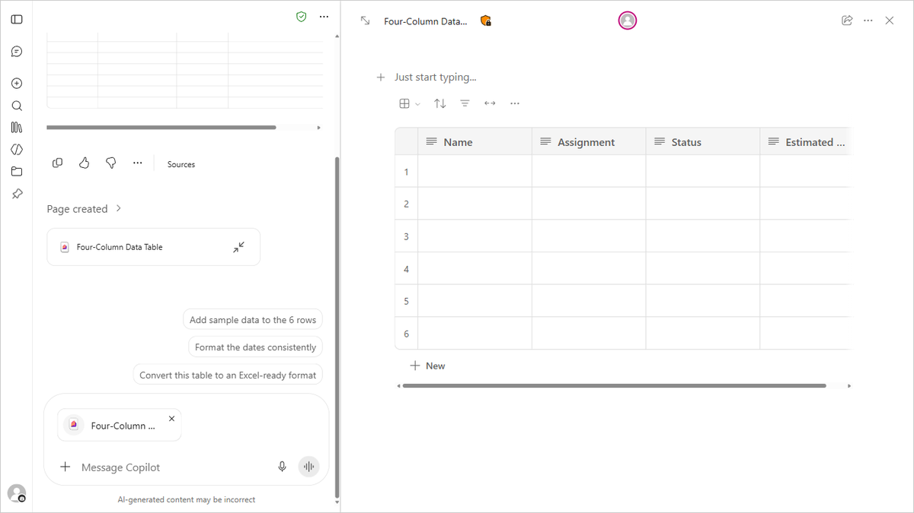

# Lab 04 — Design a Copilot Workflow

TGS-2024044051 · v3.0 · 28 September 2026

**Microsoft tool focus:** Copilot Workflows agent

All Northstar Service names, policies and values are synthetic training material. They are not a claim about a real company or a Microsoft tenant.

## Executive outcome
Complete five short, source-backed business tasks for design a copilot workflow. Each task must show a source, human owner, uncertainty, test, measurable result and go/hold/revise gate.

## Materials in this folder
- `source-pack.md` — fictional organisation context, policy and five case facts.
- `scenario.csv` — five decisions, expected outputs and challenge checks.
- `prompt-cards.md` — copy-ready prompts for each case.
- `executive-brief.docx` — editable briefing input.
- `value-model.csv` and `value-model.xlsx` — synthetic business values and formulas.
- `evidence-template.md` — decision record to copy for each case.
- `workflow-reference.png` — official Microsoft Support app example for orientation; workflow and agent screens can differ.

## Steps
1. Read BRD-1 to BRD-4 in `source-pack.md` and identify which rule applies to your case.
2. Open `scenario.csv` and select one case ID. Note its intended decision, named output, challenge and outcome measure.
3. Open the Workflows agent in Microsoft 365 Copilot if the tenant offers it. Describe the trigger and desired steps in natural language. Review, test and leave inactive until an authorised owner approves. If Workflows is unavailable, draw and test the workflow offline.
4. Copy the matching prompt from `prompt-cards.md`. Provide only the synthetic source content. Ask Copilot for a first draft, cited facts, assumptions and counterargument. For Workflows, specify trigger, action, approval and exception. For Agent Builder, specify purpose, instructions, approved knowledge and test cases.
5. Compare each material statement and number with `source-pack.md` or `value-model.xlsx`. Correct or remove unsupported claims. Recalculate net minutes: baseline minus Copilot time minus human review time.
6. Record the decision in a copy of `evidence-template.md`. State the source, evidence, owner, date, outcome measure and go/hold/revise conclusion.
7. Repeat steps 2–6 for the other four case IDs. Submit all five reviewed task records and the workflow or agent design when relevant.

## Acceptance checks
- Five case IDs have five reviewed decision records.
- Every claim or value used to justify a decision cites the supplied source.
- Every record states the strongest challenge or failed test and how it was resolved.
- Any monetary value is labelled as a synthetic assumption, not measured savings.
- The human owner approves external commitments and high-impact decisions.
- The output says “offline simulation” when the live Copilot feature was unavailable.

## Troubleshooting
If Copilot cannot see the source, check your work account and licensing with the trainer. Continue with the local files and mark the work offline. If Copilot invents a figure, remove it and ask for a source-based revision. If two sources conflict, hold the decision and name the owner who will resolve the conflict.

## UI reference

Source: https://support.microsoft.com/en-us/microsoft-365-copilot/get-started-with-workflows-in-microsoft-365-copilot (image: https://support.microsoft.com/en-us/microsoft-365-copilot/media/workflow-agent.png). Interface and licensing may differ in your tenant. Do not submit this image as your own result.

## Microsoft product references
- https://support.microsoft.com/en-us/microsoft-365-copilot/get-started-writing-prompts-in-microsoft-365-copilot
- https://learn.microsoft.com/en-us/microsoft-365/copilot/copilot-controls/security-governance
- https://support.microsoft.com/en-us/microsoft-365-copilot/get-started-with-workflows-in-microsoft-365-copilot
- https://support.microsoft.com/en-us/microsoft-365-copilot/build-your-own-agent-with-microsoft-365-copilot

