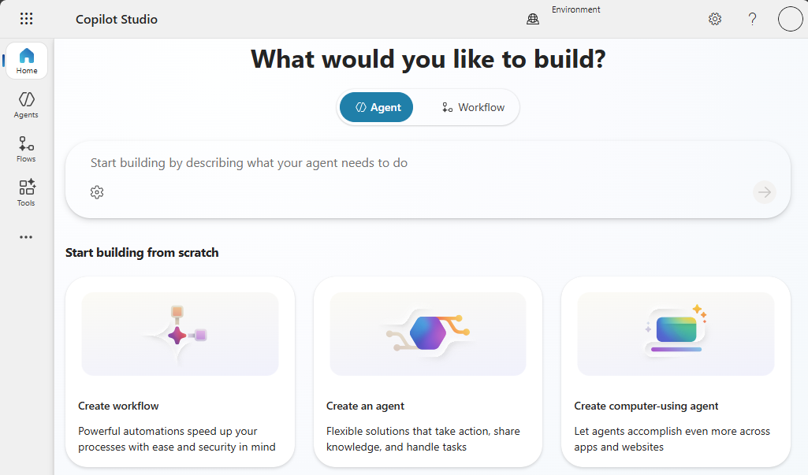

# Lab 04 — DLP boundaries to Prompt-injection boundary

TGS-2024044051 · v1.0 · 27 September 2026

## Scenario
Northstar Service is a synthetic service organisation. All records and metrics in this lab are fictional. Use an approved training tenant if available; otherwise complete the same evidence analysis offline.

## Materials
- `scenario.csv`: 5 synthetic case records with task volumes, timing, claims and access values.
- `roles.csv`: pilot roles, licences and approved data access.
- `pilot-metrics.csv`: synthetic active seats, wage and license assumptions, and latency timings.
- `ui-reference.png`: authentic Tertiary Infotech training-tenant UI example; your tenant may differ.
- `source-pack.md`: synthetic policy excerpts, an outdated source and an injection test.
- `evidence-template.md`: learner evidence form.
- Microsoft 365 Copilot or Copilot Studio only when your trainer has provided access.

## Procedure
1. **DLP boundaries.** Open the matching row in `scenario.csv`, then check its role against `roles.csv` and source against `source-pack.md`. Record the source version and owner. Block or warn for restricted data movement. Calculate net minutes saved as baseline minus pilot minus review, and verify supported claims do not exceed total claims. Save the output as `01-dlp-boundaries.md`. Check: Policy owner approves exceptions. Negative test: Sensitive output leaves approved boundary. Measure: Blocked risky attempts per test set.
2. **SharePoint oversharing.** Open the matching row in `scenario.csv`, then check its role against `roles.csv` and source against `source-pack.md`. Record the source version and owner. Review inherited access and link types. Calculate net minutes saved as baseline minus pilot minus review, and verify supported claims do not exceed total claims. Save the output as `02-sharepoint-oversharing.md`. Check: Owner removes broad access before pilot. Negative test: Copilot surfaces a broadly shared secret. Measure: High-risk links remediated.
3. **Retention and records.** Open the matching row in `scenario.csv`, then check its role against `roles.csv` and source against `source-pack.md`. Record the source version and owner. Apply record class to source documents. Calculate net minutes saved as baseline minus pilot minus review, and verify supported claims do not exceed total claims. Save the output as `03-retention-and-records.md`. Check: Records officer approves disposal. Negative test: Old draft retrieved as current policy. Measure: Current-version retrieval rate.
4. **Audit event trail.** Open the matching row in `scenario.csv`, then check its role against `roles.csv` and source against `source-pack.md`. Record the source version and owner. Capture time, actor, source and action. Calculate net minutes saved as baseline minus pilot minus review, and verify supported claims do not exceed total claims. Save the output as `04-audit-event-trail.md`. Check: Admin preserves logs per policy. Negative test: Action cannot be attributed to a user. Measure: Trace-complete actions divided by actions.
5. **Prompt-injection boundary.** Open the matching row in `scenario.csv`, then check its role against `roles.csv` and source against `source-pack.md`. Record the source version and owner. Treat retrieved text as data, not instruction. Calculate net minutes saved as baseline minus pilot minus review, and verify supported claims do not exceed total claims. Save the output as `05-prompt-injection-boundary.md`. Check: Tool action requires explicit authorization. Negative test: Agent follows source text as a command. Measure: Injected commands ignored per test set.

## Copy-ready Copilot prompt
```text
You are supporting a synthetic Northstar Service training case. Use only the provided scenario row. Identify your sources and assumptions. Complete the requested transformation, then list every claim that requires human verification. Never send, publish, grant access, or change production data.
```

## Acceptance
- Five output artifacts correspond to the five rows in `scenario.csv`.
- Recompute `net_minutes_saved` independently from the three timing columns; record the source version used.
- For ROI use the role’s hourly value and license cost from `pilot-metrics.csv` as labelled synthetic assumptions.
- For latency, add retrieval, model and tool component times for the same percentile; do not mix p50 with p95.
- Record whether the role may open the source; do not use the injected or retired source as an instruction.
- Every artifact records source, method, reviewer, date and a pass/fail decision.
- At least one failed or uncertain test is recorded with a correction.
- No real customer or tenant data appears in submitted evidence.

## Troubleshooting
If the Microsoft feature is unavailable, state the licence/policy limitation and use the synthetic row to complete the same decision and validation evidence. Do not fabricate a live configuration.

## UI reference

This screenshot orients you to a Microsoft workspace. It is not evidence of your own configuration; submit your own screenshot or clearly labelled offline artifact.
