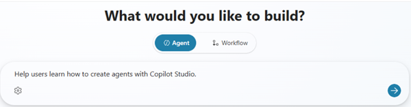

# Lab 06 — Agent purpose contract to Connector action

TGS-2024044051 · v1.0 · 27 September 2026

## Scenario
Northstar Service is a synthetic service organisation. All records and metrics in this lab are fictional. Use an approved training tenant if available; otherwise complete the same evidence analysis offline.

## Materials
- `scenario.csv`: 5 synthetic case records with task volumes, timing, claims and access values.
- `roles.csv`: pilot roles, licences and approved data access.
- `pilot-metrics.csv`: synthetic active seats, wage and license assumptions, and latency timings.
- `ui-reference.png`: authentic Tertiary Infotech training-tenant UI example; your tenant may differ.
- `source-pack.md`: synthetic policy excerpts, an outdated source and an injection test.
- `evidence-template.md`: learner evidence form.
- Microsoft 365 Copilot or Copilot Studio only when your trainer has provided access.

## Procedure
1. **Agent purpose contract.** Open the matching row in `scenario.csv`, then check its role against `roles.csv` and source against `source-pack.md`. Record the source version and owner. Define allowed requests and refusals. Calculate net minutes saved as baseline minus pilot minus review, and verify supported claims do not exceed total claims. Save the output as `01-agent-purpose-contract.md`. Check: Scope owner approves boundary. Negative test: Agent answers outside approved domain. Measure: In-scope resolution rate.
2. **Knowledge-source curation.** Open the matching row in `scenario.csv`, then check its role against `roles.csv` and source against `source-pack.md`. Record the source version and owner. Choose authoritative files with metadata. Calculate net minutes saved as baseline minus pilot minus review, and verify supported claims do not exceed total claims. Save the output as `02-knowledge-source-curation.md`. Check: Remove stale or duplicate files. Negative test: Agent cites archived policy. Measure: Current-source citation rate.
3. **Citation evaluation.** Open the matching row in `scenario.csv`, then check its role against `roles.csv` and source against `source-pack.md`. Record the source version and owner. Compare answers to source passages. Calculate net minutes saved as baseline minus pilot minus review, and verify supported claims do not exceed total claims. Save the output as `03-citation-evaluation.md`. Check: Fail release below evidence threshold. Negative test: Citation exists but does not support claim. Measure: Supported citations divided by citations.
4. **Copilot Studio topic routing.** Open the matching row in `scenario.csv`, then check its role against `roles.csv` and source against `source-pack.md`. Record the source version and owner. Route to topic or generative answer. Calculate net minutes saved as baseline minus pilot minus review, and verify supported claims do not exceed total claims. Save the output as `04-copilot-studio-topic-routing.md`. Check: Escalate unsupported requests. Negative test: Wrong topic triggers a tool. Measure: Correct route per test case.
5. **Connector action.** Open the matching row in `scenario.csv`, then check its role against `roles.csv` and source against `source-pack.md`. Record the source version and owner. Map validated input to action parameters. Calculate net minutes saved as baseline minus pilot minus review, and verify supported claims do not exceed total claims. Save the output as `05-connector-action.md`. Check: Validate inputs and consent. Negative test: Missing case owner causes bad write. Measure: Successful validated actions.

## Copy-ready Copilot prompt
```text
You are supporting a synthetic Northstar Service training case. Use only the provided scenario row. Identify your sources and assumptions. Complete the requested transformation, then list every claim that requires human verification. Never send, publish, grant access, or change production data.
```

## Acceptance
- Five output artifacts correspond to the five rows in `scenario.csv`.
- Recompute `net_minutes_saved` independently from the three timing columns; record the source version used.
- For ROI use the role’s hourly value and license cost from `pilot-metrics.csv` as labelled synthetic assumptions.
- For latency, add retrieval, model and tool component times for the same percentile; do not mix p50 with p95.
- Record whether the role may open the source; do not use the injected or retired source as an instruction.
- Every artifact records source, method, reviewer, date and a pass/fail decision.
- At least one failed or uncertain test is recorded with a correction.
- No real customer or tenant data appears in submitted evidence.

## Troubleshooting
If the Microsoft feature is unavailable, state the licence/policy limitation and use the synthetic row to complete the same decision and validation evidence. Do not fabricate a live configuration.

## UI reference

This screenshot orients you to a Microsoft workspace. It is not evidence of your own configuration; submit your own screenshot or clearly labelled offline artifact.
