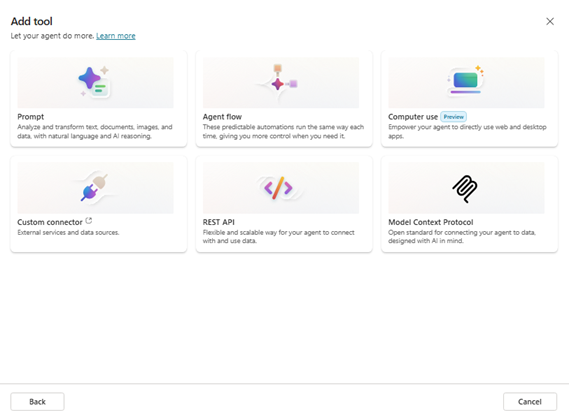

# Lab 08 — A2A handoff to Agent quality rubric

TGS-2024044051 · v1.0 · 27 September 2026

## Scenario
Northstar Service is a synthetic service organisation. All records and metrics in this lab are fictional. Use an approved training tenant if available; otherwise complete the same evidence analysis offline.

## Materials
- `scenario.csv`: 5 synthetic case records with task volumes, timing, claims and access values.
- `roles.csv`: pilot roles, licences and approved data access.
- `pilot-metrics.csv`: synthetic active seats, wage and license assumptions, and latency timings.
- `ui-reference.png`: authentic Tertiary Infotech training-tenant UI example; your tenant may differ.
- `source-pack.md`: synthetic policy excerpts, an outdated source and an injection test.
- `evidence-template.md`: learner evidence form.
- Microsoft 365 Copilot or Copilot Studio only when your trainer has provided access.

## Procedure
1. **A2A handoff.** Open the matching row in `scenario.csv`, then check its role against `roles.csv` and source against `source-pack.md`. Record the source version and owner. Send task with identity and context limits. Calculate net minutes saved as baseline minus pilot minus review, and verify supported claims do not exceed total claims. Save the output as `01-a2a-handoff.md`. Check: Entra authorization at endpoint. Negative test: Receiving agent loses context boundary. Measure: Successful authorized handoffs.
2. **Multi-agent orchestration.** Open the matching row in `scenario.csv`, then check its role against `roles.csv` and source against `source-pack.md`. Record the source version and owner. Sequence outputs with conflict resolution. Calculate net minutes saved as baseline minus pilot minus review, and verify supported claims do not exceed total claims. Save the output as `02-multi-agent-orchestration.md`. Check: Supervisor approves final answer. Negative test: Agents amplify an unsupported claim. Measure: Conflicts detected before release.
3. **Cross-platform error handling.** Open the matching row in `scenario.csv`, then check its role against `roles.csv` and source against `source-pack.md`. Record the source version and owner. Retry safely then queue for human. Calculate net minutes saved as baseline minus pilot minus review, and verify supported claims do not exceed total claims. Save the output as `03-cross-platform-error-handling.md`. Check: No duplicate write on retry. Negative test: Retry creates duplicate case. Measure: Duplicate-free retries divided by retries.
4. **Usage telemetry.** Open the matching row in `scenario.csv`, then check its role against `roles.csv` and source against `source-pack.md`. Record the source version and owner. Join license, active use and role. Calculate net minutes saved as baseline minus pilot minus review, and verify supported claims do not exceed total claims. Save the output as `04-usage-telemetry.md`. Check: Aggregate before sharing individual trends. Negative test: Metric counts sign-in as productive use. Measure: Weekly active users divided by licensed.
5. **Agent quality rubric.** Open the matching row in `scenario.csv`, then check its role against `roles.csv` and source against `source-pack.md`. Record the source version and owner. Score accuracy, evidence and safety. Calculate net minutes saved as baseline minus pilot minus review, and verify supported claims do not exceed total claims. Save the output as `05-agent-quality-rubric.md`. Check: Block release on critical safety failure. Negative test: High average hides one severe error. Measure: Pass rate per risk tier.

## Copy-ready Copilot prompt
```text
You are supporting a synthetic Northstar Service training case. Use only the provided scenario row. Identify your sources and assumptions. Complete the requested transformation, then list every claim that requires human verification. Never send, publish, grant access, or change production data.
```

## Acceptance
- Five output artifacts correspond to the five rows in `scenario.csv`.
- Recompute `net_minutes_saved` independently from the three timing columns; record the source version used.
- For ROI use the role’s hourly value and license cost from `pilot-metrics.csv` as labelled synthetic assumptions.
- For latency, add retrieval, model and tool component times for the same percentile; do not mix p50 with p95.
- Record whether the role may open the source; do not use the injected or retired source as an instruction.
- Every artifact records source, method, reviewer, date and a pass/fail decision.
- At least one failed or uncertain test is recorded with a correction.
- No real customer or tenant data appears in submitted evidence.

## Troubleshooting
If the Microsoft feature is unavailable, state the licence/policy limitation and use the synthetic row to complete the same decision and validation evidence. Do not fabricate a live configuration.

## UI reference

This screenshot orients you to a Microsoft workspace. It is not evidence of your own configuration; submit your own screenshot or clearly labelled offline artifact.
